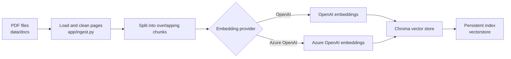
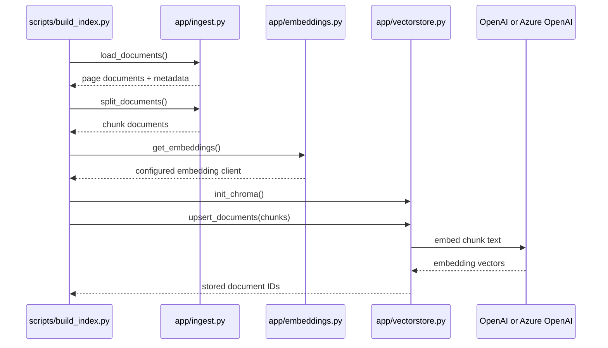
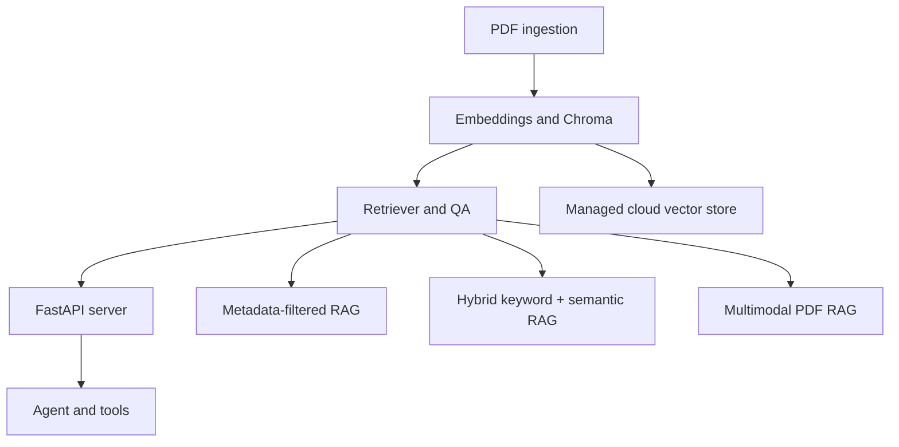

# Azure RAG Agent

A local-first Retrieval-Augmented Generation (RAG) project for indexing PDF
documents with OpenAI or Azure OpenAI embeddings and storing them in a
persistent Chroma vector database.

The current implementation covers the indexing side of the pipeline:

- Deterministic PDF loading and text cleanup
- Page-level metadata preservation
- Overlapping text chunking
- Provider-selectable OpenAI or Azure OpenAI embeddings
- Deterministic chunk identifiers
- Persistent local Chroma indexing
- A command-line index builder with safe clean-rebuild support

Retrieval, question answering, the API, and the agent layer are planned next.

## Architecture



The build command coordinates reusable modules rather than placing all logic
inside one script:



## Current Status

| Component | Status | Location |
|---|---|---|
| PDF ingestion and cleanup | Implemented | `app/ingest.py` |
| Text chunking | Implemented | `app/ingest.py` |
| OpenAI/Azure embedding selection | Implemented | `app/embeddings.py` |
| Local Chroma persistence | Implemented | `app/vectorstore.py` |
| Index-build CLI | Implemented | `scripts/build_index.py` |
| Retriever and QA | Planned | `app/rag.py` |
| FastAPI server | Planned | `app/server.py` |
| Agent and tools | Planned | `app/agent.py` |

## Requirements

- Python 3.12 or newer
- `uv` recommended for dependency management
- An OpenAI API key or an Azure OpenAI embedding deployment
- Text-based PDF files for the current ingestion pipeline

Scanned PDFs and information contained only in diagrams or images are not yet
processed. OCR and multimodal ingestion are roadmap items.

## Setup

Clone the repository and install its locked dependencies:

```bash
git clone <repository-url>
cd azure-rag-agent
uv sync
```

Alternatively, use a standard virtual environment:

```bash
python3.12 -m venv .venv
source .venv/bin/activate
python -m pip install -e .
```

Create a local `.env` file in the repository root. Never commit this file.

### OpenAI Configuration

```env
EMBEDDINGS_PROVIDER=openai
OPENAI_API_KEY=your-openai-api-key
OPENAI_EMBEDDINGS_MODEL=text-embedding-3-small

# Optional settings for compatible or customized endpoints:
OPENAI_API_BASE=
OPENAI_API_TYPE=
OPENAI_API_VERSION=
```

### Azure OpenAI Configuration

Create an Azure OpenAI embedding deployment first, then configure:

```env
EMBEDDINGS_PROVIDER=azure
AZURE_OPENAI_API_KEY=your-azure-openai-key
AZURE_OPENAI_ENDPOINT=https://your-resource.openai.azure.com/
AZURE_OPENAI_API_VERSION=your-supported-api-version
AZURE_OPENAI_API_TYPE=azure
AZURE_OPENAI_EMBEDDINGS_DEPLOYMENT=your-deployment-name
AZURE_OPENAI_EMBEDDINGS_MODEL=text-embedding-3-small
```

`AZURE_OPENAI_EMBEDDINGS_DEPLOYMENT` is the deployment name created in Azure,
which may differ from the underlying model name.

If `EMBEDDINGS_PROVIDER` is omitted, the code prefers a complete Azure
configuration and otherwise uses OpenAI when `OPENAI_API_KEY` is available.

## Add Documents

Place PDF files in:

```text
data/docs/
```

The default file pattern is `*.pdf`, which scans only that directory. Use
`--pattern "**/*.pdf"` to include nested directories.

Each extracted page becomes a LangChain `Document` with:

| Metadata | Meaning |
|---|---|
| `source` | Original PDF path |
| `file_name` | PDF filename |
| `page` | Human-readable, one-based page number |
| `total_pages` | Number of pages in the source PDF |

This metadata survives chunking and is stored with each vector for later source
attribution and filtering.

## Build the Index

Build or update the default `documents` collection:

```bash
uv run python scripts/build_index.py
```

Or use the virtual environment directly:

```bash
.venv/bin/python scripts/build_index.py
```

Perform a clean rebuild by deleting the existing index first:

```bash
uv run python scripts/build_index.py --force
```

Use custom locations or chunk settings:

```bash
uv run python scripts/build_index.py \
  --source-dir data/docs \
  --pattern "**/*.pdf" \
  --chunk-size 1000 \
  --chunk-overlap 200 \
  --persist-dir vectorstore \
  --collection-name documents \
  --force
```

View all command options:

```bash
uv run python scripts/build_index.py --help
```

Building the index sends extracted document text to the configured embedding
provider and may incur API usage charges.

## How Indexing Works

For every PDF:

1. `load_documents()` reads pages, normalizes whitespace, and preserves source
   metadata.
2. `split_documents()` creates overlapping chunks in deterministic order.
3. `get_embeddings()` selects OpenAI or Azure OpenAI from the environment.
4. `init_chroma()` opens the persistent Chroma collection.
5. `upsert_documents()` creates deterministic IDs, embeds the chunk text, and
   stores IDs, vectors, text, and metadata.

A stored item is conceptually:

```text
ID       deterministic SHA-1 identifier
Text     original chunk content
Vector   numerical semantic representation
Metadata source file and page information
```

Use the same embedding model for indexing and future retrieval. Changing the
embedding model requires rebuilding the entire index because vectors from
different models are not directly comparable.

## Project Structure

```text
azure-rag-agent/
├── app/
│   ├── embeddings.py     # Provider selection and embedding helpers
│   ├── ingest.py         # PDF loading, cleanup, and chunking
│   └── vectorstore.py    # Chroma initialization and document storage
├── data/
│   └── docs/             # Local PDF corpus
├── scripts/
│   └── build_index.py    # Runnable indexing workflow
├── skills/
│   └── knowledge-capture/
├── RAG_AGENT_PLAN.md     # Implementation plan and roadmap
├── knowledge.md          # Durable project knowledge
├── pyproject.toml
└── uv.lock
```

## Roadmap



Planned enhancements include:

- Retriever and source-grounded question answering
- FastAPI endpoints for querying and reindexing
- Agent tools for web search, local documents, Python, and diagrams
- Metadata-filtered retrieval
- Hybrid keyword and semantic search
- Multimodal retrieval from figures, diagrams, charts, tables, and images
- A managed cloud vector store such as Azure AI Search
- Containerization and Azure deployment artifacts
- Unit and integration tests

See `RAG_AGENT_PLAN.md` for the detailed implementation plan.

## Troubleshooting

### No embedding provider is configured

Set `EMBEDDINGS_PROVIDER` and the required provider variables in `.env`. For
Azure, the endpoint, API key, and embedding deployment are all required.

### No PDFs were found

Confirm that PDF files exist in `data/docs/`, or pass the correct
`--source-dir` and `--pattern`.

### A PDF produces no documents

The current loader uses `pypdf` text extraction. Image-only or scanned PDFs
need OCR, which is not implemented yet.

### Retrieval quality changes after switching models

Delete and rebuild the index with `--force`. Do not mix vectors generated by
different embedding models.

### Chroma deprecation warnings

The current implementation uses the LangChain community Chroma wrapper and an
explicit persistence call. Migrating to the dedicated `langchain-chroma`
package is tracked as a future maintenance task.

## Security

- Keep `.env`, API keys, source documents, and local vector indexes out of Git.
- Treat indexed documents as data sent to the selected embedding provider.
- Use least-privilege credentials and rotate exposed keys immediately.
- Prefer Microsoft Entra ID or managed identity for production Azure
  deployments when that authentication path is implemented.
- Review document privacy and provider data policies before indexing sensitive
  content.

## Contributing

Keep changes aligned with `AGENTS.md` and the staged RAG architecture. Public
functions should use explicit type hints, ingestion must preserve metadata, and
document processing order should remain deterministic.
